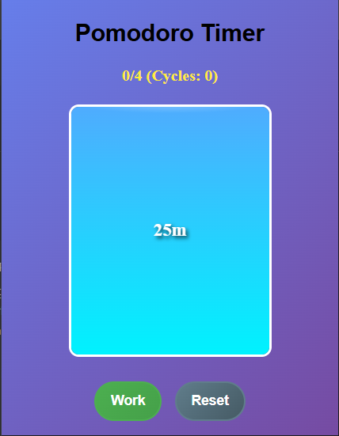
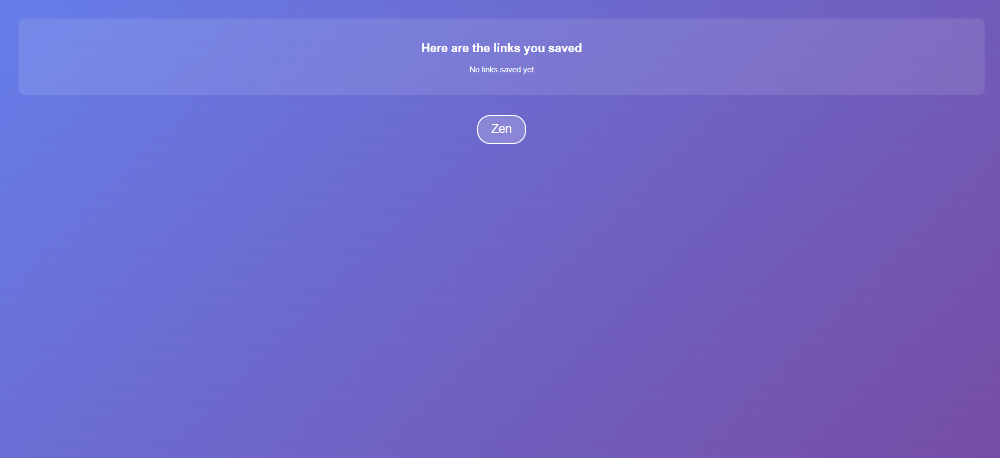

# Reminder-Chrome-Extension

## Overview
The **Reminder Chrome Extension** is a productivity tool designed to help users manage their time effectively using the Pomodoro technique. It provides a timer for work sessions, short breaks, and long breaks, along with additional features like saved links and a Zen mode for focused breaks.

### Features
- **Pomodoro Timer**: Manage your work and break sessions with a simple timer.
- **Saved Links**: Save links to revisit during your breaks.
- **Zen Mode**: Enter a calming overlay during breaks to relax and recharge.
- **Customizable Breaks**: Includes short breaks (5 minutes) and long breaks (25 minutes every 4 cycles).
- **Notifications**: Get notified when your work or break session ends.

## Installation
1. Clone or download this repository.
2. Open Chrome and navigate to `chrome://extensions`.
3. Enable **Developer Mode**.
4. Click **Load unpacked** and select the folder containing this extension.

## Usage
1. Click on the extension icon to open the popup.
2. Start a work session, short break, or long break using the respective buttons.
3. Save links using the context menu by right-clicking on a link and selecting "Save link to break."
4. Access saved links during breaks via the break page.
5. Use Zen mode for a calming break experience.

## Screenshots
### Popup Interface

### Break Page

## Socials
Feel free to connect with me on social media:
- **GitHub**: [Your GitHub Profile](https://github.com/yourusername)
- **Twitter**: [Your Twitter Profile](https://twitter.com/yourusername)
- **LinkedIn**: [Your LinkedIn Profile](https://linkedin.com/in/yourusername)

## License
This project is licensed under the MIT License. See the [LICENSE](LICENSE) file for details.

## Contributing
Contributions are welcome! If you'd like to improve this extension, feel free to submit a pull request or open an issue.

## Contact
For any questions or feedback, reach out via email: [your.email@example.com](mailto:your.email@example.com)